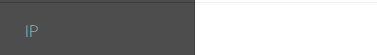

# Twitter Trends Fetcher

This project is a web application that fetches and displays Twitter trends using Selenium and Flask. It saves the trends along with the current IP address in a MongoDB database. The project utilizes environmental variables for sensitive data handling, like Twitter credentials, MongoDB URI, and proxy IP.

---

## Features
- Fetch trending topics from Twitter using Selenium.
- Display top trends in the frontend.
- Save trends and associated data (e.g., IP address, timestamp) into MongoDB.
- Proxy support for requests.

---

## Prerequisites
1. Install [Python](https://www.python.org/).
2. Install [Google Chrome](https://www.google.com/chrome/) and [ChromeDriver](https://sites.google.com/chromium.org/driver/).
3. Install [MongoDB](https://www.mongodb.com/try/download/community).

---

## Installation

1. Clone the repository:
   ```bash
   git clone <https://github.com/gauravmaddi/Stir-Web-scrapping-Assignment.git>
   
   ```

2. Create a virtual environment:
   ```bash
   python -m venv venv
   source venv/bin/activate  # On Windows, use `venv\Scripts\activate`
   ```

3. Install dependencies:
   ```bash
   pip install -r requirements.txt
   ```

4. Create a `.env` file:
   ```env
   MONGO_URI=mongodb://localhost:27017/
   TWITTER_USERNAME=<your_twitter_username>
   TWITTER_PASSWORD=<your_twitter_password>
   PROXY_IP=<your_proxy_ip:port>
   ```

---

## Usage

### Run the Application

1. Start MongoDB:
   ```bash
   mongod
   ```

2. Run the Flask application:
   ```bash
   python app.py
   ```

3. Open your browser and navigate to:
   ```
   http://127.0.0.1:5000/
   ```

4. To fetch the trends, hit the `/run-script` endpoint:
   ```
   http://127.0.0.1:5000/run-script
   ```

---

## Project Structure

```plaintext
.
├── app.py                # Flask app handling endpoints
├── database.py           # MongoDB connection and data-saving logic
├── selenium_script.py    # Selenium script to fetch Twitter trends
├── requirements.txt      # Dependencies list
├── .env                  # Environment variables
├── templates/
│   └── index.html        # Frontend template
└── README.md             # Project documentation
```
---

## Authenticate Your IP From This Section 


---
## Take IP From Here 


---
## Take Port Number From Here 


---
